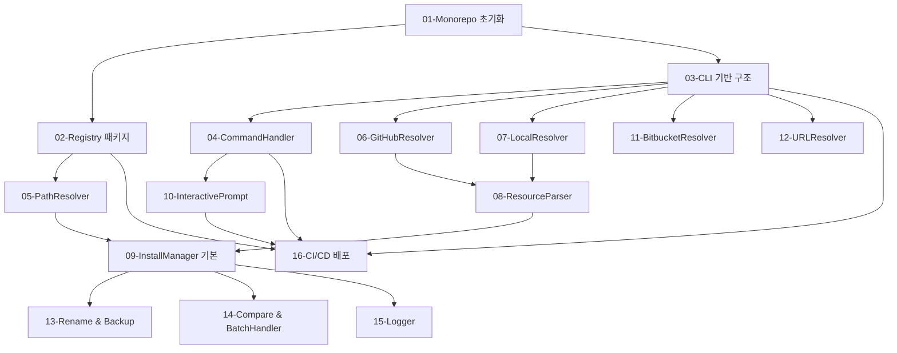

# Step 3: Task Analysis 결과

## 1. 요약

- 총 **16개의 서브태스크**로 분해 (P0: 9개, P1: 5개, P2: 2개)
- **5개 병렬 작업** 가능 (Phase 2: Resolvers, Phase 4: Duplicate handlers)
- 예상 구현 순서: **Phase 1 (초기화) → Phase 2 (핵심 모듈) → Phase 3 (통합) → Phase 4 (고급 기능) → Phase 5 (배포)**

## 2. 분해 전략

### 2.1 분해 기준

- **모듈 경계**:
  - Registry 패키지와 CLI 패키지를 명확히 분리
  - CLI 내부를 6개 모듈로 분리 (commands, source, parser, install, prompts, utils)
  - 각 Resolver를 독립적으로 구현 (GitHub, Bitbucket, Local, URL)

- **의존성**:
  - Turborepo 빌드 순서: Registry → CLI
  - CLI 내부: Types → Utils/Resolvers → Parser → Install → Commands
  - 순환 의존성 없는 DAG 구조 유지

- **병렬화 가능성**:
  - Phase 1: 모든 초기화 작업 순차 (pnpm workspace 설정 필요)
  - Phase 2: GitHubResolver, BitbucketResolver, LocalResolver, URLResolver 병렬 구현
  - Phase 3: Parser와 Install은 순차 (Parser 출력 → Install 입력)
  - Phase 4: Rename, Backup, Compare, BatchHandler 병렬 구현
  - Phase 5: 순차 (빌드 → 테스트 → 배포)

### 2.2 우선순위 기준

| 우선순위 | 기준 | 태스크 수 |
|----------|------|----------|
| P0 - Critical | Monorepo 기반, 핵심 설치 플로우 (Skip/Overwrite) | 9개 |
| P1 - High | 고급 중복 처리, 추가 소스 지원 | 5개 |
| P2 - Medium | 배포, Registry 리소스 | 2개 |

## 3. 서브태스크 개요

| 번호 | 제목 | 우선순위 | 복잡도 | 의존성 | 예상 결과물 |
|------|------|----------|--------|--------|-------------|
| 01 | Turborepo Monorepo 초기화 | P0 | Medium | None | Root package.json, turbo.json, pnpm-workspace.yaml |
| 02 | Registry 패키지 구현 | P0 | Medium | 01 | packages/registry/ 전체 |
| 03 | CLI 패키지 기반 구조 | P0 | Low | 01 | packages/cli/ 디렉토리, types.ts |
| 04 | CommandHandler 구현 | P0 | Medium | 03 | CommandHandler.ts, CLI 진입점 |
| 05 | PathResolver 구현 | P0 | Low | 02 | PathResolver.ts (Registry 사용) |
| 06 | GitHubResolver 구현 | P0 | High | 03 | GitHubResolver.ts |
| 07 | LocalResolver 구현 | P0 | Low | 03 | LocalResolver.ts |
| 08 | ResourceParser 구현 | P0 | Medium | 03, 06, 07 | ResourceParser.ts, YAMLParser.ts |
| 09 | InstallManager 기본 구현 | P0 | Medium | 05, 08 | InstallManager.ts, FileWriter.ts |
| 10 | InteractivePrompt 구현 | P1 | Medium | 04 | InteractivePrompt.ts |
| 11 | BitbucketResolver 구현 | P1 | Medium | 03 | BitbucketResolver.ts |
| 12 | URLResolver 구현 | P1 | Low | 03 | URLResolver.ts |
| 13 | Rename & Backup 구현 | P1 | Medium | 09 | DuplicateHandler 확장 |
| 14 | Compare & BatchHandler 구현 | P1 | High | 09 | Compare 로직, 일괄 처리 |
| 15 | Logger 및 결과 출력 | P2 | Low | 09 | Logger.ts, progress bar |
| 16 | CI/CD 및 npm 배포 | P2 | Low | All | .github/workflows/, npm publish |

## 4. 의존성 그래프



## 5. 실행 계획

### Phase 1: Monorepo 초기화 (순차)

**목표**: Turborepo 기반 프로젝트 구조 완성

- [ ] `01-TASK.md` - Turborepo Monorepo 초기화
- [ ] `02-TASK.md` - Registry 패키지 구현 (agents.json 포함)
- [ ] `03-TASK.md` - CLI 패키지 기반 구조 (types, 디렉토리)

**완료 조건**:
- `pnpm turbo build` 성공
- `node packages/cli/bin/ai-toolkit.js --help` 실행 가능

### Phase 2: 핵심 모듈 구현 (일부 병렬 가능)

**목표**: CLI 플래그 파싱, 소스 해석, 경로 매핑

**순차 작업**:
- [ ] `04-TASK.md` - CommandHandler 구현 (의존: 03)
- [ ] `05-TASK.md` - PathResolver 구현 (의존: 02)

**병렬 작업** (03 의존, 동시 진행 가능):
- [ ] `06-TASK.md` - GitHubResolver 구현
- [ ] `07-TASK.md` - LocalResolver 구현

**완료 조건**:
- 인터랙티브 모드에서 Type, Source 입력 가능
- GitHub/로컬에서 파일 목록 가져오기 성공

### Phase 3: 파싱 및 설치 (순차)

**목표**: Resource 파싱 및 기본 설치 로직

- [ ] `08-TASK.md` - ResourceParser 구현 (의존: 06, 07)
- [ ] `09-TASK.md` - InstallManager 기본 구현 (의존: 05, 08)

**완료 조건**:
- GitHub repo에서 스킬 설치 성공
- 중복 Skip/Overwrite 동작

### Phase 4: 고급 기능 (병렬 가능)

**목표**: 고급 중복 처리, 추가 소스, UX 개선

**병렬 작업** (09 의존 후 동시 진행):
- [ ] `10-TASK.md` - InteractivePrompt 구현 (의존: 04)
- [ ] `11-TASK.md` - BitbucketResolver 구현 (의존: 03)
- [ ] `12-TASK.md` - URLResolver 구현 (의존: 03)
- [ ] `13-TASK.md` - Rename & Backup 구현 (의존: 09)
- [ ] `14-TASK.md` - Compare & BatchHandler 구현 (의존: 09)

**순차 작업**:
- [ ] `15-TASK.md` - Logger 및 결과 출력 (의존: 09)

**완료 조건**:
- 모든 중복 처리 전략 동작
- Bitbucket, URL 소스 지원
- 설치 결과 표시 및 progress bar

### Phase 5: 배포 (순차)

**목표**: CI/CD 설정 및 npm 배포

- [ ] `16-TASK.md` - CI/CD 및 npm 배포 (의존: All)

**완료 조건**:
- npm에 @ai-toolkit/cli 퍼블리시 성공
- `npx @ai-toolkit/cli` 실행 성공

## 6. TASK_MASTER 지침

### 공통 컨벤션

```typescript
// 파일 구조
packages/
├── cli/
│   └── src/
│       ├── commands/       // CLI 진입점
│       ├── source/         // Source Resolvers
│       ├── parser/         // YAML 파싱
│       ├── install/        // 설치 로직
│       ├── prompts/        // inquirer UI
│       └── utils/          // 공통 유틸
└── registry/
    └── src/
        ├── data/           // agents.json
        ├── PathResolver.ts
        └── types.ts

// 네이밍 규칙
- 클래스명: PascalCase (CommandHandler, GitHubResolver)
- 파일명: PascalCase.ts (CommandHandler.ts)
- 타입명: PascalCase (ResourceType, AgentKey)
- 함수명: camelCase (parseFlags, resolveAgentPath)

// Import 순서
1. Node.js built-in (fs, path)
2. External (inquirer, commander, octokit)
3. Workspace (@ai-toolkit/registry)
4. Internal (./types, ./utils)
```

### 공통 품질 기준

- [ ] 단위 테스트 커버리지 80% 이상 (Vitest)
- [ ] 타입 안정성 (TypeScript strict mode)
- [ ] 에러 처리 (모든 Promise에 try-catch 또는 .catch())
- [ ] 보안 검토 (경로 traversal 방지, 원자적 쓰기)
- [ ] JSDoc 주석 (공개 API에만)

### Git 커밋 규칙

```bash
# 각 서브태스크 완료 시
git commit -m "feat/AI-TOOLKIT-001-[AI]: [작업 요약]"

# 예시
git commit -m "feat/AI-TOOLKIT-001-[AI]: Add Turborepo monorepo structure"
git commit -m "feat/AI-TOOLKIT-001-[AI]: Implement GitHubResolver with rate limit handling"
```

## 7. 생성된 파일

다음 파일들이 `todos/` 디렉토리에 생성되었습니다:

```
.ai/tasks/AI-TOOLKIT-001/todos/
├── 00-TASK_MASTER.md       # 전체 조율 문서
├── 01-TASK.md              # Turborepo Monorepo 초기화
├── 02-TASK.md              # Registry 패키지 구현
├── 03-TASK.md              # CLI 패키지 기반 구조
├── 04-TASK.md              # CommandHandler 구현
├── 05-TASK.md              # PathResolver 구현
├── 06-TASK.md              # GitHubResolver 구현
├── 07-TASK.md              # LocalResolver 구현
├── 08-TASK.md              # ResourceParser 구현
├── 09-TASK.md              # InstallManager 기본 구현
├── 10-TASK.md              # InteractivePrompt 구현
├── 11-TASK.md              # BitbucketResolver 구현
├── 12-TASK.md              # URLResolver 구현
├── 13-TASK.md              # Rename & Backup 구현
├── 14-TASK.md              # Compare & BatchHandler 구현
├── 15-TASK.md              # Logger 및 결과 출력
└── 16-TASK.md              # CI/CD 및 npm 배포
```

## 8. 다음 단계

### 수동 실행 (개별 선택)

각 서브태스크를 직접 선택하여 실행:

```bash
# 1. 원하는 태스크 파일 읽기
cat .ai/tasks/AI-TOOLKIT-001/todos/01-TASK.md

# 2. 새 대화에서 해당 태스크 구현
# "AI-TOOLKIT-001 Task 01 시작해줘"

# 3. 완료 후 TASK_MASTER.md 상태 업데이트
```

### 자동 실행 (task-master agent 사용)

병렬 작업 자동화를 원하는 경우 (Phase 2, Phase 4):

```bash
# task-master agent가 TASK_MASTER.md를 읽고
# 병렬 가능한 서브태스크들을 동시에 spawn
# (향후 구현 예정)
```

## 9. 주의사항

- **컨텍스트 격리**: 각 서브태스크는 해당 TASK.md만 참조, 20-output-system-design.md 재로드 금지
- **의존성 준수**:
  - Phase 1 완료 전에 Phase 2 시작 금지
  - 09-InstallManager 완료 전에 13, 14 시작 금지
- **상태 동기화**: TASK_MASTER.md 진행 상황 표 반드시 업데이트
- **통합 테스트**: Phase 3 완료 시점에 E2E 테스트 (GitHub → 로컬 설치)
- **Turborepo 캐싱**: 빌드 순서 변경 시 turbo.json pipeline 업데이트
