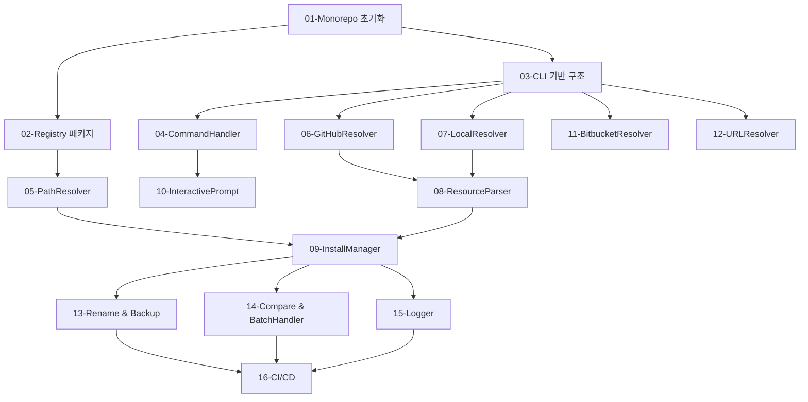

# AI-TOOLKIT-001 TASK MASTER

> 전체 조율 문서 - 각 서브태스크 실행 시 이 문서는 참조하지 않습니다.

---

## INSTRUCTION - Progressive Disclosure 원칙

### 컨텍스트 격리

각 서브태스크는 **독립적으로 실행**됩니다:

```
┌─────────────────────────────────────────────┐
│ 개별 TASK.md (~1000 토큰)                   │
│ - 해당 작업의 구현 상세만 포함             │
│ - 전체 설계 문서 재로드 금지               │
│ - 독립적으로 실행 가능                      │
└─────────────────────────────────────────────┘
```

### 이 문서의 역할

- 전체 구조 및 의존성 파악
- 공통 컨벤션 참조
- 진행 상황 추적
- **개별 TASK.md는 이 문서를 참조하지 않음**

---

## 프로젝트 개요

**목표**: AI 코딩 에이전트용 Skills/Rules/Commands/Agents 일괄 배포 CLI 도구

**아키텍처**: Turborepo monorepo (CLI + Registry 패키지)

**핵심 기능**:
1. GitHub/Bitbucket/로컬/URL에서 리소스 가져오기
2. 6개 에이전트(Antigravity, Claude Code, Cursor, Gemini CLI, GitHub Copilot, OpenCode)에 배포
3. 중복 처리 (Skip/Overwrite/Rename/Backup/Compare)

---

## 공통 코딩 컨벤션

### 디렉토리 구조

```
packages/
├── cli/
│   ├── src/
│   │   ├── commands/       # CLI 진입점 (CommandHandler)
│   │   ├── source/         # Source Resolvers (GitHub, Bitbucket, Local, URL)
│   │   ├── parser/         # YAML 파싱 (ResourceParser, YAMLParser)
│   │   ├── install/        # 설치 로직 (InstallManager, DuplicateHandler, FileWriter)
│   │   ├── prompts/        # inquirer UI (InteractivePrompt)
│   │   ├── utils/          # 공통 유틸 (Logger, hash, fs-safe, diff)
│   │   └── index.ts        # 진입점
│   ├── bin/
│   │   └── ai-toolkit.js   # npx 진입점
│   └── package.json
└── registry/
    ├── src/
    │   ├── index.ts        # Registry 진입점
    │   ├── PathResolver.ts # 경로 매핑
    │   └── types.ts        # Agent 타입
    ├── data/
    │   └── agents.json     # 6개 에이전트 메타데이터
    └── package.json
```

### 네이밍 규칙

- **클래스명**: PascalCase (`CommandHandler`, `GitHubResolver`)
- **파일명**: PascalCase.ts (`CommandHandler.ts`, `GitHubResolver.ts`)
- **타입명**: PascalCase (`ResourceType`, `AgentKey`, `DuplicateAction`)
- **함수명**: camelCase (`parseFlags`, `resolveAgentPath`, `install`)
- **상수명**: UPPER_SNAKE_CASE (`DEFAULT_TIMEOUT`, `MAX_RETRIES`)

### Import 순서

```typescript
// 1. Node.js built-in
import * as fs from 'node:fs';
import * as path from 'node:path';

// 2. External dependencies
import inquirer from 'inquirer';
import { Command } from 'commander';
import { Octokit } from 'octokit';

// 3. Workspace packages
import { PathResolver } from '@ai-toolkit/registry';

// 4. Internal (relative imports)
import { ResourceType, AgentKey } from './types';
import { hashContent } from './utils/hash';
```

### TypeScript 설정

```jsonc
// tsconfig.json (각 패키지)
{
  "extends": "../../tsconfig.base.json",
  "compilerOptions": {
    "strict": true,
    "noUnusedLocals": true,
    "noUnusedParameters": true,
    "noImplicitReturns": true
  }
}
```

### 에러 처리

```typescript
// Promise는 반드시 try-catch 또는 .catch()
try {
  const result = await fetchFromGitHub(owner, repo);
  return result;
} catch (error) {
  if (error instanceof NetworkError) {
    throw new Error(`Network error: ${error.message}`);
  }
  throw error;
}

// 파일 시스템 작업은 원자적 쓰기
async function atomicWrite(filePath: string, content: string): Promise<void> {
  const tmpPath = `${filePath}.tmp`;
  await fs.promises.writeFile(tmpPath, content, 'utf-8');
  await fs.promises.rename(tmpPath, filePath);
}
```

---

## 공통 품질 기준

### 테스트

- [ ] **단위 테스트 커버리지**: 80% 이상 (Vitest)
- [ ] **통합 테스트**: 각 Phase 완료 시 통합 테스트
- [ ] **E2E 테스트**: Phase 3 완료 시 전체 플로우 테스트

### 타입 안전성

- [ ] TypeScript strict mode 준수
- [ ] `any` 타입 금지 (불가피한 경우 `unknown` 사용)
- [ ] 모든 공개 API에 타입 명시

### 보안

- [ ] 경로 traversal 방지 (`path.resolve()` 사용)
- [ ] 원자적 파일 쓰기 (임시 파일 → rename)
- [ ] GitHub/Bitbucket API rate limit 처리

### 문서화

- [ ] 공개 API에 JSDoc 주석
- [ ] 복잡한 로직에 주석 추가
- [ ] README.md 업데이트 (기능 추가 시)

---

## Git 커밋 규칙

### 커밋 메시지 형식

```bash
feat/AI-TOOLKIT-001-[AI]: <작업 요약>

# 예시
feat/AI-TOOLKIT-001-[AI]: Add Turborepo monorepo structure
feat/AI-TOOLKIT-001-[AI]: Implement GitHubResolver with rate limit handling
feat/AI-TOOLKIT-001-[AI]: Add ResourceParser with YAML frontmatter support
```

### 커밋 시점

- 각 서브태스크 완료 시 1개 커밋
- 테스트 추가 시 별도 커밋 가능
- WIP 커밋 금지 (완료된 단위만 커밋)

---

## 전체 아키텍처

### 패키지 의존성

```
@ai-toolkit/cli
    ↓ depends on
@ai-toolkit/registry
```

### CLI 모듈 흐름

```
CommandHandler (CLI 진입점)
    ↓
InteractivePrompt (사용자 입력)
    ↓
SourceResolver (GitHub/Bitbucket/로컬/URL → 파일 목록)
    ↓
ResourceParser (파일 → Resource 객체)
    ↓
InstallManager (경로 매핑 + 설치)
    ↓ uses
PathResolver (Registry에서 경로 가져오기)
```

---

## 서브태스크 목록

### Phase 1: Monorepo 초기화 (순차) ✅

| 번호 | 제목 | 우선순위 | 복잡도 | 의존성 | 상태 |
|------|------|----------|--------|--------|------|
| 01 | Turborepo Monorepo 초기화 | P0 | Medium | None | ✅ completed |
| 02 | Registry 패키지 구현 | P0 | Medium | 01 | ✅ completed |
| 03 | CLI 패키지 기반 구조 | P0 | Low | 01 | ✅ completed |

**완료 조건**: `pnpm turbo build` 성공 ✅

---

### Phase 2: 핵심 모듈 구현 (일부 병렬)

| 번호 | 제목 | 우선순위 | 복잡도 | 의존성 | 상태 |
|------|------|----------|--------|--------|------|
| 04 | CommandHandler 구현 | P0 | Medium | 03 | pending |
| 05 | PathResolver 구현 | P0 | Low | 02 | pending |
| 06 | GitHubResolver 구현 | P0 | High | 03 | pending |
| 07 | LocalResolver 구현 | P0 | Low | 03 | pending |

**병렬 가능**: 06, 07 (03 의존 후 동시 진행)

**완료 조건**: GitHub/로컬에서 파일 목록 가져오기 성공

---

### Phase 3: 파싱 및 설치 (순차)

| 번호 | 제목 | 우선순위 | 복잡도 | 의존성 | 상태 |
|------|------|----------|--------|--------|------|
| 08 | ResourceParser 구현 | P0 | Medium | 06, 07 | pending |
| 09 | InstallManager 기본 구현 | P0 | Medium | 05, 08 | pending |

**완료 조건**: GitHub repo에서 스킬 설치 성공, 중복 Skip/Overwrite 동작

---

### Phase 4: 고급 기능 (병렬 가능)

| 번호 | 제목 | 우선순위 | 복잡도 | 의존성 | 상태 |
|------|------|----------|--------|--------|------|
| 10 | InteractivePrompt 구현 | P1 | Medium | 04 | pending |
| 11 | BitbucketResolver 구현 | P1 | Medium | 03 | pending |
| 12 | URLResolver 구현 | P1 | Low | 03 | pending |
| 13 | Rename & Backup 구현 | P1 | Medium | 09 | pending |
| 14 | Compare & BatchHandler 구현 | P1 | High | 09 | pending |
| 15 | Logger 및 결과 출력 | P2 | Low | 09 | pending |

**병렬 가능**: 11, 12, 13, 14 (각각의 의존성 충족 후)

**완료 조건**: 모든 중복 처리 전략 동작, Bitbucket/URL 소스 지원

---

### Phase 5: 배포 (순차)

| 번호 | 제목 | 우선순위 | 복잡도 | 의존성 | 상태 |
|------|------|----------|--------|--------|------|
| 16 | CI/CD 및 npm 배포 | P2 | Low | All | pending |

**완료 조건**: `npx @ai-toolkit/cli` 실행 성공

---

## 의존성 그래프



---

## 진행 상황 추적

### 전체 진행률

- [x] Phase 1: Monorepo 초기화 (3/3) ✅
- [ ] Phase 2: 핵심 모듈 구현 (0/4)
- [ ] Phase 3: 파싱 및 설치 (0/2)
- [ ] Phase 4: 고급 기능 (0/6)
- [ ] Phase 5: 배포 (0/1)

**총 진행률**: 3/16 (18.75%)

### 최근 업데이트

| 날짜 | 작업 | 담당자 | 상태 |
|------|------|--------|------|
| 2026-01-23 | Task 03: CLI 패키지 기반 구조 | AI | ✅ completed |
| 2026-01-23 | Task 02: Registry 패키지 구현 | AI | ✅ completed |
| 2026-01-23 | Task 01: Turborepo Monorepo 초기화 | AI | ✅ completed |

---

## 실행 가이드

### 수동 실행

```bash
# 1. 태스크 파일 읽기
cat .ai/tasks/AI-TOOLKIT-001/todos/01-TASK.md

# 2. 새 대화에서 실행
# "AI-TOOLKIT-001 Task 01 시작해줘"

# 3. 완료 후 이 문서의 진행 상황 표 업데이트
```

### 병렬 실행 (권장 시점)

- **Phase 2**: Task 06, 07 병렬 실행 (03 완료 후)
- **Phase 4**: Task 11, 12, 13, 14 병렬 실행 (각각의 의존성 충족 후)

---

## 주의사항

1. **컨텍스트 격리**: 각 TASK.md는 독립적으로 실행, 20-output-system-design.md 재로드 금지
2. **의존성 준수**: 의존성이 완료되지 않은 태스크는 시작 금지
3. **상태 동기화**: 작업 완료 시 이 문서의 진행 상황 표 반드시 업데이트
4. **통합 테스트**: Phase 3 완료 시점에 E2E 테스트 필수
5. **Turborepo 캐싱**: 빌드 순서 변경 시 turbo.json pipeline 업데이트

---

## 체크리스트

### Phase 완료 체크리스트

- [x] Phase 1 완료: `pnpm turbo build` 성공 ✅
- [ ] Phase 2 완료: GitHub/로컬에서 파일 목록 가져오기 성공
- [ ] Phase 3 완료: E2E 테스트 (GitHub → 로컬 설치) 통과
- [ ] Phase 4 완료: 모든 중복 처리 전략 테스트 통과
- [ ] Phase 5 완료: npm 배포 및 `npx @ai-toolkit/cli` 실행 성공

### 품질 체크리스트

- [ ] 모든 단위 테스트 통과 (커버리지 80% 이상)
- [ ] TypeScript strict mode 위반 없음
- [ ] 모든 에러 핸들링 구현
- [ ] README.md 업데이트 완료
- [ ] Git 커밋 메시지 규칙 준수

---

**최종 업데이트**: 2026-01-23
