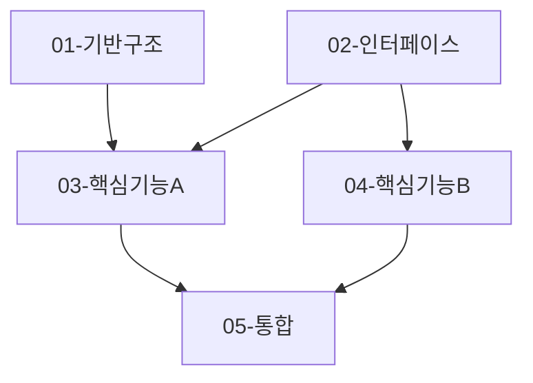

# Step 3: Task Analysis 결과

## 1. 요약

<!-- 태스크 분해의 핵심 전략 (2-3문장) -->
- 총 [N]개의 서브태스크로 분해
- [N]개 병렬 작업 가능
- 예상 구현 순서: [Phase 1 → Phase 2 → Phase 3]

## 2. 분해 전략

### 2.1 분해 기준

- **모듈 경계**: [어떤 모듈/컴포넌트 단위로 분리했는가]
- **의존성**: [의존성 분석 결과]
- **병렬화 가능성**: [어떤 작업들이 동시에 진행 가능한가]

### 2.2 우선순위 기준

| 우선순위 | 기준 | 태스크 수 |
|----------|------|----------|
| P0 - Critical | 기반 구조, 핵심 인터페이스 | [N]개 |
| P1 - High | 핵심 기능 구현 | [N]개 |
| P2 - Medium | 최적화, 추가 기능 | [N]개 |

## 3. 서브태스크 개요

| 번호 | 제목 | 우선순위 | 복잡도 | 의존성 | 예상 결과물 |
|------|------|----------|--------|--------|-------------|
| 01 | [태스크 제목] | P0 | Low/Med/High | None | [파일/기능] |
| 02 | [태스크 제목] | P0 | Low/Med/High | None | [파일/기능] |
| 03 | [태스크 제목] | P1 | Low/Med/High | 01, 02 | [파일/기능] |
| ... | ... | ... | ... | ... | ... |

## 4. 의존성 그래프



## 5. 실행 계획

### Phase 1: 기반 구조 (병렬 가능)

**목표**: 핵심 인터페이스와 기반 구조 완성

- [ ] `01-TASK.md` - [제목]
- [ ] `02-TASK.md` - [제목]

**완료 조건**: [Phase 1 완료 기준]

### Phase 2: 핵심 기능

**목표**: 주요 비즈니스 로직 구현

- [ ] `03-TASK.md` - [제목] (의존: 01, 02)
- [ ] `04-TASK.md` - [제목] (의존: 02)

**완료 조건**: [Phase 2 완료 기준]

### Phase 3: 통합 및 최적화

**목표**: 전체 통합 및 품질 개선

- [ ] `05-TASK.md` - [제목] (의존: 03, 04)

**완료 조건**: [Phase 3 완료 기준]

## 6. TASK_MASTER 지침

### 공통 컨벤션

```typescript
// [프로젝트의 코딩 스타일]
// [네이밍 규칙]
// [파일 구조 규칙]
```

### 공통 품질 기준

- [ ] 단위 테스트 커버리지 [N]% 이상
- [ ] 타입 안정성 (TypeScript strict mode)
- [ ] 에러 처리 (모든 Promise에 catch)
- [ ] 보안 검토 (XSS, injection 방지)

### Git 커밋 규칙

```bash
# 각 서브태스크 완료 시
git commit -m "feat/[TASK_ID]-[AI]: [작업 요약]"

# 예시
git commit -m "feat/PROJ-001-[AI]: Add base interface and types"
```

## 7. 생성된 파일

다음 파일들이 `todos/` 디렉토리에 생성되었습니다:

```
.ai/tasks/[TASK_ID]/todos/
├── 00-TASK_MASTER.md       # 전체 조율 문서
├── 01-TASK.md              # 서브태스크 1
├── 02-TASK.md              # 서브태스크 2
├── 03-TASK.md              # 서브태스크 3
...
```

## 8. 다음 단계

### 수동 실행 (개별 선택)

각 서브태스크를 직접 선택하여 실행:

```bash
# 1. 원하는 태스크 파일 읽기
cat .ai/tasks/[TASK_ID]/todos/01-TASK.md

# 2. 해당 태스크 구현 진행
# 3. 완료 후 TASK_MASTER.md 상태 업데이트
```

### 자동 실행 (task-master agent 사용)

병렬 작업 자동화를 원하는 경우:

```bash
# task-master agent가 TASK_MASTER.md를 읽고
# 서브에이전트들을 spawn하여 병렬로 작업 수행
# (구현 예정)
```

## 9. 주의사항

- **컨텍스트 격리**: 각 서브태스크는 해당 TASK.md만 참조
- **의존성 준수**: 차단된 태스크는 의존성 완료 후 시작
- **상태 동기화**: TASK_MASTER.md 진행 상황 표 업데이트 필수
- **통합 테스트**: 모든 서브태스크 완료 후 전체 통합 검증
