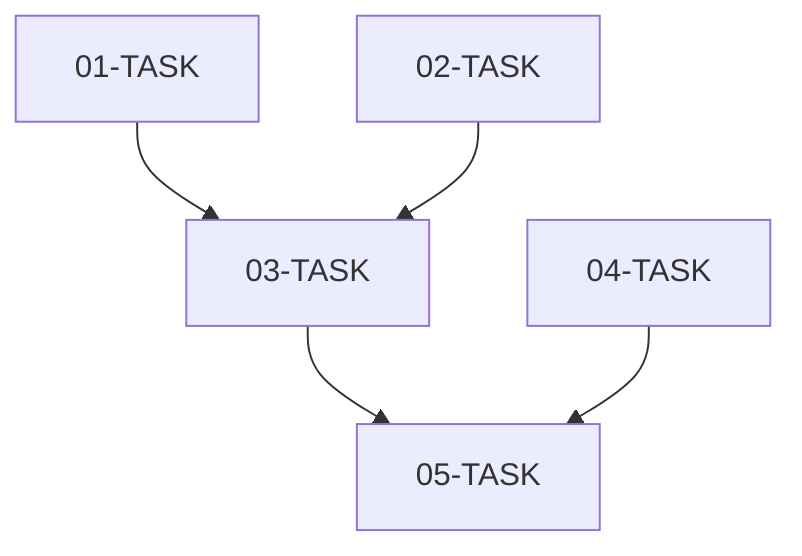

# Task Master: [TASK_ID]

> 전체 작업 조율 및 서브태스크 관리

## INSTRUCTION

### 컨텍스트 원칙 (Progressive Disclosure)

각 서브태스크는 독립적으로 실행되며, 전체 컨텍스트가 아닌 해당 태스크에 필요한 정보만 포함합니다.

- **TASK_MASTER**: 전체 구조, 의존성, 우선순위 관리
- **개별 TASK**: 해당 작업의 구현 상세만 포함

### 공통 지침

#### 코딩 컨벤션
- [프로젝트의 코딩 스타일]
- [네이밍 컨벤션]
- [파일 구조 규칙]

#### 품질 기준
- [ ] 단위 테스트 작성
- [ ] 타입 안정성 확보
- [ ] 에러 처리 구현
- [ ] 보안 취약점 검토

#### Git 규칙
```
git commit -m "feat: [TASK_ID]-[SUB_TASK_NUM] - [요약]"
```

## 전체 구조

### 아키텍처 개요

```
[전체 시스템 구조도]
```

### 데이터 흐름

```
[데이터 흐름도]
```

## 서브태스크 목록

### 우선순위별 분류

#### P0 - Critical (병렬 가능)
- `01-TASK.md` - [태스크 제목]
- `02-TASK.md` - [태스크 제목]

#### P1 - High (P0 완료 후)
- `03-TASK.md` - [태스크 제목]
- `04-TASK.md` - [태스크 제목]

#### P2 - Medium
- `05-TASK.md` - [태스크 제목]

### 의존성 그래프



## 실행 계획

### Phase 1: 기반 구조 (병렬)
- [ ] `01-TASK.md` - [담당자/상태]
- [ ] `02-TASK.md` - [담당자/상태]

### Phase 2: 핵심 기능
- [ ] `03-TASK.md` - [담당자/상태]
- [ ] `04-TASK.md` - [담당자/상태]

### Phase 3: 통합 및 최적화
- [ ] `05-TASK.md` - [담당자/상태]

## 진행 상황

| 태스크 | 우선순위 | 상태 | 담당자 | 완료일 |
|--------|----------|------|--------|--------|
| 01-TASK | P0 | pending | - | - |
| 02-TASK | P0 | pending | - | - |
| 03-TASK | P1 | pending | - | - |
| 04-TASK | P1 | pending | - | - |
| 05-TASK | P2 | pending | - | - |

## 통합 테스트

전체 서브태스크 완료 후 수행:

- [ ] 전체 기능 통합 테스트
- [ ] 성능 테스트
- [ ] 크로스 브라우저 테스트 (필요시)
- [ ] E2E 테스트

## 완료 조건

- [ ] 모든 서브태스크 완료
- [ ] 통합 테스트 통과
- [ ] 문서화 완료
- [ ] 코드 리뷰 완료

---

## Step 4 종료 처리

> **중요**: 모든 서브태스크가 completed 상태가 되면 아래 절차를 **반드시** 수행합니다.

### 1. 완료 확인

```bash
# 진행 상황 테이블에서 모든 태스크가 ✅ completed인지 확인
# pending 또는 in_progress 태스크가 있으면 먼저 완료
```

### 2. 40-output-implementation.md 생성 (필수)

템플릿 기반으로 구현 결과 문서를 작성합니다:

```bash
# 출력 파일 위치
.ai/tasks/<TASK_ID>/40-output-implementation.md
```

**포함 내용**:
- 요약: 구현한 기능의 핵심 내용
- 구현 내역: Phase별 파일 생성/수정 및 커밋 이력
- 검증 결과: 체크리스트 항목별 상태
- 변경 파일 목록: 전체 변경 파일 및 설명
- 다음 단계: Step 5에서 검토할 사항

### 3. status.yaml 업데이트

**출력물 생성 후에만** status.yaml을 업데이트합니다:

```yaml
current_step: step-5
steps:
  step-4:
    status: completed  # 40-output 생성 후 변경
  step-5:
    status: pending
```

### 4. Git 커밋

```bash
git add .ai/tasks/<TASK_ID>/40-output-implementation.md
git add .ai/tasks/<TASK_ID>/status.yaml
git commit -m "feat/<TASK_ID>-[AI]: Complete Step 4 - implementation summary"
```

### 5. 다음 Step 안내

```
✅ Step 4 완료!

새 대화에서 다음 명령어로 Step 5를 시작하세요:
"<TASK_ID> 작업 이어서 진행해줘"
```
