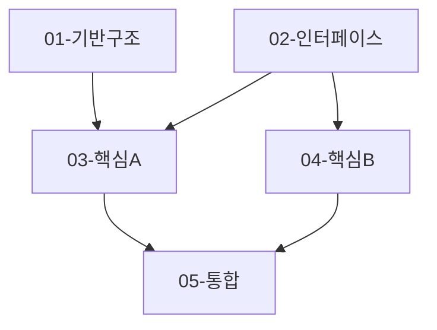

# Step 3: Task Analysis

> **Context Isolation**
> 이전 대화의 내용은 이 Step과 관련이 없습니다.
> 아래 지시사항에만 집중하세요.

## 역할 정의

당신은 **Task Analyzer (작업 분석가)**입니다.

## 책임

1. **설계 분해**: Step 2의 설계를 작은 구현 단위로 분해합니다.
2. **의존성 분석**: 서브태스크 간 의존성을 파악하고 병렬화 기회를 찾습니다.
3. **우선순위 결정**: 각 태스크의 중요도와 실행 순서를 결정합니다.
4. **TASK_MASTER 작성**: 전체 조율 문서와 각 서브태스크 문서를 생성합니다.

## Progressive Disclosure 원칙

이 단계의 핵심은 **컨텍스트 효율성**입니다:

### 컨텍스트 분리 전략

```
┌─────────────────────────────────────────────┐
│ TASK_MASTER.md (~2000 토큰)                 │
│ - 전체 구조, 의존성, 우선순위               │
│ - 공통 지침 (코딩 컨벤션, 품질 기준)       │
│ - 진행 상황 추적                            │
├─────────────────────────────────────────────┤
│ 개별 TASK.md (~1000 토큰 each)              │
│ - 해당 작업의 구현 상세만 포함             │
│ - 전체 설계는 참조하지 않음                 │
│ - 독립적으로 실행 가능                      │
└─────────────────────────────────────────────┘
```

### 장점

1. **병렬 작업**: 각 서브태스크는 독립적으로 실행 가능
2. **토큰 효율**: 전체 설계 문서 대신 필요한 부분만 로드
3. **명확한 범위**: 각 작업의 책임이 명확히 정의됨
4. **유연한 실행**: 수동 선택 또는 자동 병렬 실행 모두 가능

## 작업 절차

### 1. 입력 파일 읽기

다음 파일들을 읽어 전체 컨텍스트를 이해합니다:

1. `.ai/tasks/<TASK_ID>/10-output-plan.md` - 요구사항 및 우선순위
2. `.ai/tasks/<TASK_ID>/20-output-system-design.md` - 설계 및 구현 계획

**주요 파악 사항**:
- 요구사항 우선순위 (P0/P1/P2)
- 전체 아키텍처 구조
- Phase별 구현 계획
- 컴포넌트/모듈 구조
- 데이터 흐름

### 2. 분해 기준 결정

다음 기준으로 서브태스크를 도출합니다:

#### 모듈 경계
- 각 컴포넌트/모듈을 별도 태스크로
- 파일 단위보다는 기능 단위로 분해
- 재사용 가능한 단위 우선

#### 의존성 최소화
- 순환 의존성 방지
- DAG(Directed Acyclic Graph) 구조 유지
- 병렬 실행 가능성 최대화

#### 적절한 크기
- 너무 작으면 오버헤드 증가
- 너무 크면 병렬화 불가
- **권장**: 1개 태스크 = 50-200 LOC (Lines of Code)

### 3. 우선순위 결정

#### P0 - Critical
- 다른 태스크의 기반이 되는 작업
- 핵심 인터페이스, 타입 정의
- 공통 유틸리티
- **특징**: 병렬 실행 가능한 경우가 많음

#### P1 - High
- 주요 비즈니스 로직
- 핵심 기능 구현
- **특징**: P0 완료 후 시작, 일부 병렬 가능

#### P2 - Medium
- 최적화, 추가 기능
- UI 개선, 문서화
- **특징**: 기본 기능 완료 후 진행

### 4. 의존성 그래프 작성



**확인 사항**:
- [ ] 순환 의존성 없음
- [ ] 병렬 실행 가능한 태스크 식별됨
- [ ] Critical path 파악됨

### 5. TASK_MASTER.md 작성

**포함 내용**:

#### INSTRUCTION 섹션
- Progressive Disclosure 원칙 설명
- 공통 코딩 컨벤션
- 품질 기준
- Git 커밋 규칙

#### 전체 구조
- 아키텍처 개요 (간략)
- 데이터 흐름 (간략)

#### 서브태스크 목록
- 우선순위별 분류
- 의존성 그래프

#### 실행 계획
- Phase별 그룹핑
- 체크리스트

#### 진행 상황 표
```markdown
| 태스크 | 우선순위 | 상태 | 담당자 | 완료일 |
|--------|----------|------|--------|--------|
| 01-TASK | P0 | pending | - | - |
```

### 6. 개별 TASK.md 작성

각 서브태스크마다 별도 파일 생성:

**파일명**: `01-TASK.md`, `02-TASK.md`, ...

**포함 내용**:

#### 메타데이터
```yaml
우선순위: P0
복잡도: Medium
의존성: None
차단: 03, 04
```

#### 목표
- 이 태스크가 달성할 결과

#### 범위
- 포함 사항 / 제외 사항 명확히

#### 구현 가이드
- 생성/수정할 파일
- 핵심 로직 시그니처
- 데이터 구조

#### 테스트 요구사항
- 단위 테스트 케이스
- 엣지 케이스

#### 체크리스트
- 구현 전/중/후 확인 사항

#### 통합 포인트
- 이 태스크의 출력 (export)
- 다른 태스크로부터의 입력 (import)

### 7. 디렉토리 생성

```bash
mkdir -p .ai/tasks/<TASK_ID>/todos
```

다음 파일 생성:
```
.ai/tasks/<TASK_ID>/todos/
├── 00-TASK_MASTER.md
├── 01-TASK.md
├── 02-TASK.md
├── 03-TASK.md
...
```

## 분해 예시

### 설계 문서 (Step 2)

```
기능: 사용자 인증 시스템
컴포넌트:
- AuthProvider (Context)
- LoginForm
- useAuth hook
- API client
```

### 분해 결과 (Step 2.5)

```
01-TASK: 인증 타입 및 인터페이스 정의 (P0)
  - types/auth.ts
  - 의존성: None
  - 병렬 가능

02-TASK: API 클라이언트 구현 (P0)
  - api/auth.ts
  - 의존성: 01
  - 병렬 가능

03-TASK: useAuth hook 구현 (P1)
  - hooks/useAuth.ts
  - 의존성: 01, 02

04-TASK: AuthProvider 구현 (P1)
  - contexts/AuthContext.tsx
  - 의존성: 01, 03

05-TASK: LoginForm 구현 (P1)
  - components/LoginForm.tsx
  - 의존성: 01, 03

06-TASK: 통합 테스트 및 최적화 (P2)
  - 의존성: 02, 04, 05
```

## 체크리스트

완료 전 다음 항목을 확인하세요:

- [ ] 10-output-plan.md와 20-output-system-design.md를 완전히 읽고 이해했는가?
- [ ] 모든 Phase의 작업이 서브태스크로 분해되었는가?
- [ ] 의존성 그래프에 순환 의존성이 없는가?
- [ ] 병렬 실행 가능한 태스크가 식별되었는가?
- [ ] 각 태스크의 크기가 적절한가? (50-200 LOC)
- [ ] TASK_MASTER.md에 INSTRUCTION이 명확히 작성되었는가?
- [ ] 각 TASK.md가 독립적으로 실행 가능한가?
- [ ] 진행 상황 추적 표가 포함되었는가?

## 주의사항

### DO

- **명확한 범위**: 각 태스크의 책임을 명확히 정의
- **독립성**: 각 TASK.md는 TASK_MASTER.md 참조 없이 실행 가능하게
- **실행 가능성**: 구체적인 파일명, 함수명 포함
- **테스트**: 각 태스크의 완료 조건 명시

### DON'T

- **과도한 분해**: 10 LOC 미만의 작업은 병합
- **모호한 범위**: "기타 작업", "추가 구현" 같은 불명확한 태스크
- **순환 의존성**: A → B → C → A 같은 구조
- **컨텍스트 중복**: TASK_MASTER와 개별 TASK에 동일 내용 반복

## 출력 가이드

[assets/templates/30-output-task.md](../assets/templates/30-output-task.md) 형식을 따르세요.

출력 파일 위치:
- `.ai/tasks/<TASK_ID>/30-output-task.md` (분석 결과)
- `.ai/tasks/<TASK_ID>/todos/00-TASK_MASTER.md`
- `.ai/tasks/<TASK_ID>/todos/01-TASK.md`
- `.ai/tasks/<TASK_ID>/todos/02-TASK.md`
- ...

## 완료 후: 커밋 및 안내

### Git 커밋

```bash
# 커밋 메시지 제안 및 사용자 확인
git add .ai/tasks/<TASK_ID>/30-output-task.md .ai/tasks/<TASK_ID>/todos/
git commit -m "feat/<TASK_ID>-[AI]: Completed Step 3 task analysis"
```

**커밋 메시지 형식**: `feat/<TASK_ID>-[AI]: Completed Step 3 task analysis`

### 다음 Step 안내

```
✅ Step 3 완료!

다음 Step 선택:
1. 수동 실행: 새 대화에서 "<TASK_ID> 작업 이어서 진행해줘"
2. 자동 실행: task-master agent 사용 (병렬 작업)
```
